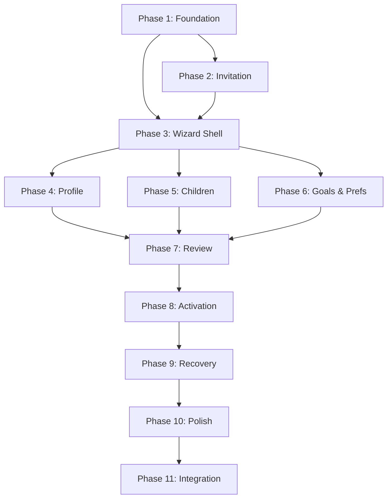

# Implementation Tasks: Onboarding & Activation Frontend

## Definition of Done

Every task is considered complete when ALL of the following are satisfied:

1. **Code compiles** — `npm run build` passes without errors
2. **Types are correct** — no TypeScript errors (`tsc --noEmit` passes)
3. **Lint passes** — no ESLint errors on modified files
4. **Tests pass** — all existing and new tests green
5. **Requirement traceability** — implementation satisfies all referenced acceptance criteria
6. **Accessibility baseline** — form fields have labels, errors linked via aria-describedby, keyboard navigable
7. **RTL verified** — layout renders correctly in both LTR and RTL (if UI task)
8. **No regressions** — existing WEB-SPEC-008 functionality unchanged

---

## Recommended Pull Request Strategy

| PR | Contents | Prerequisite |
|----|----------|-------------|
| **PR 1** | Phase 1 (foundation: types, services, route shell) | WEB-SPEC-008 PR 1 merged (shared apiClient) |
| **PR 2** | Phase 2 (invitation validation + error states) | PR 1 |
| **PR 3** | Phase 3 (wizard shell + navigation logic) | PR 1 |
| **PR 4** | Phase 4 (Father Profile form) | PR 3 |
| **PR 5** | Phase 5 (Children setup) | PR 3 |
| **PR 6** | Phase 6 (Goals + Preferences) | PR 3 |
| **PR 7** | Phase 7 (Review + Provisioning) | PR 4, 5, 6 |
| **PR 8** | Phase 8 (Activation + Polling) | PR 7 |
| **PR 9** | Phase 9 (Session recovery + error handling) | PR 8 |
| **PR 10** | Phase 10 (Localization + accessibility + responsive) | All prior |
| **PR 11** | Phase 11 (Integration + e2e) | All prior |

PRs 4–6 can be developed in parallel after PR 3.

---

## Task Dependency Graph

---

## Tasks

- [ ] 1. Phase 1: Onboarding Foundation
  - [ ] 1.1 Create `src/types/onboarding.ts` — type definitions: InvitationValidation, SessionCreateResponse, SessionState, StepResponse, ProvisioningResponse, ActivationStatus, WizardStep enum, OnboardingError.
    - _Requirements: All_
  - [ ] 1.2 Create `src/services/onboarding.ts` — API service module using shared apiClient: validateInvitation, createSession, getSession, submitStep, completeOnboarding, getActivationStatus, retryActivation.
    - _Requirements: All_
  - [ ] 1.3 Create `src/constants/onboarding.ts` — step definitions (name, required, order), predefined goals list, coaching style options, activity type options, validation limits.
    - _Requirements: 6, 7_
  - [ ] 1.4 Create `src/utils/phone.ts` — E.164 formatting helper, country code extraction, phone masking (****1234).
    - _Requirements: 4_
  - [ ] 1.5 Create route structure: `app/join/[token]/layout.tsx` and placeholder pages for all steps. Layout renders OnboardingLayout component (empty shell for now).
    - _Requirements: 1, 12_

- [ ] 2. Phase 2: Invitation Validation
  - [ ] 2.1 Create `app/join/[token]/page.tsx` — invitation entry page. Calls validateInvitation on mount. Shows skeleton during load. Routes to Welcome on success.
    - _Requirements: 1.1, 1.7_
  - [ ] 2.2 Create `src/components/onboarding/InvitationError.tsx` — handles all error states: 404 (invalid), 410 (expired/used), 429 (rate limited with countdown). Each displays appropriate copy per FR-4.
    - _Requirements: 1.3, 1.4, 1.5, 1.6_
  - [ ] 2.3 Create `src/components/onboarding/WelcomeScreen.tsx` — displays value proposition, inviter name (if available), "Get Started" button. Triggers session creation on click.
    - _Requirements: 2.1, 2.2, 2.3_
  - [ ] 2.4 Implement session creation flow: POST on "Get Started" click, handle 201 (navigate to language), 409 (show duplicate message), 5xx (show error with retry).
    - _Requirements: 2.4, 2.5, 2.6_
  - [ ] 2.5 Write tests: valid invitation shows Welcome, 404 shows error, 410 shows expired message, 429 shows countdown, network offline shows retry.
    - _Requirements: 1.1–1.7_

- [ ] 3. Phase 3: Wizard Shell and Navigation
  - [ ] 3.1 Create OnboardingProvider (React Context): holds sessionId, currentStep, completedSteps, language, isSubmitting, error. Provides navigation methods: goForward, goBack, skipStep.
    - _Requirements: 11, 12_
  - [ ] 3.2 Create `src/components/onboarding/StepIndicator.tsx` — visual progress indicator showing current position, completed steps, total count. Uses aria-current="step". Adjusts count when steps skipped.
    - _Requirements: 11.1, 11.2, 11.3, 11.4, 11.5_
  - [ ] 3.3 Create `src/components/onboarding/OnboardingLayout.tsx` — renders StepIndicator + content slot + navigation footer (Back/Next/Skip buttons). Enforces linear navigation rules.
    - _Requirements: 12.1, 12.2, 12.3, 12.4_
  - [ ] 3.4 Implement navigation guards: prevent forward if step not validated, prevent direct URL access to future steps (redirect to currentStep), allow back always.
    - _Requirements: 12.3, 12.5_
  - [ ] 3.5 Create `src/components/onboarding/SkipButton.tsx` — "Skip for now" button. Only renders on optional steps. Advances to next step without submission.
    - _Requirements: 12.4_
  - [ ] 3.6 Write tests: navigation enforces linear order, back preserves data, skip only on optional steps, direct URL to future step redirects.
    - _Requirements: 11, 12_

- [ ] 4. Phase 4: Father Profile Form
  - [ ] 4.1 Create `src/components/onboarding/ProfileForm.tsx` — form with: display_name, phone_number (with country code selector), email (optional), timezone (with auto-detect pre-fill). Zod schema for client validation.
    - _Requirements: 4.1, 4.2, 4.3, 4.4, 4.5_
  - [ ] 4.2 Implement inline validation: validate on blur (field level), validate all on submit. Map backend error codes to field names. Focus first invalid field on submit failure.
    - _Requirements: 4.6, 4.7_
  - [ ] 4.3 Implement phone input with country code selector: default +972, E.164 formatting, visual feedback on valid/invalid format.
    - _Requirements: 4.3_
  - [ ] 4.4 Handle HTTP 409 (duplicate phone): show inline error "This number is already registered" with login link placeholder (WEB-SPEC-002 dependency).
    - _Requirements: 4.7_
  - [ ] 4.5 Wire submission: on valid form, call submitStep('FATHER_PROFILE', data). On success, advance to Children. On error, show inline errors.
    - _Requirements: 4.8, 4.10_
  - [ ] 4.6 Write tests: valid submission advances, invalid fields show errors on blur, duplicate phone shows 409 message, timezone auto-detects.
    - _Requirements: 4.1–4.10_

- [ ] 5. Phase 5: Children Setup
  - [ ] 5.1 Create `src/components/onboarding/ChildrenForm.tsx` — dynamic list of child forms. "Add another child" button (max 8). Remove button per child.
    - _Requirements: 5.1, 5.2_
  - [ ] 5.2 Create `src/components/onboarding/ChildCard.tsx` — single child form: name, birth_date (date picker), gender (optional), interests (tag input), challenges (tag input).
    - _Requirements: 5.1_
  - [ ] 5.3 Implement per-child validation: name 2–30 chars, birth_date 0–18 years past. Each child validates independently.
    - _Requirements: 5.5, 5.7_
  - [ ] 5.4 Implement skip behavior: "Skip for now" advances without submission. If children added: submit all via submitStep('CHILDREN', data).
    - _Requirements: 5.3, 5.6_
  - [ ] 5.5 Write tests: add/remove children works, max 8 enforced, validation per child, skip submits nothing, empty state message renders.
    - _Requirements: 5.1–5.8_

- [ ] 6. Phase 6: Goals and Preferences
  - [ ] 6.1 Create `src/components/onboarding/GoalsSelector.tsx` — predefined goal cards (multi-select 1–5) + custom goal text input (max 100 chars). Visual selection state.
    - _Requirements: 6.1, 6.2, 6.3_
  - [ ] 6.2 Create `app/join/[token]/goals/page.tsx` — Goals step page. Submit via submitStep('GOALS', data). Skip applies default.
    - _Requirements: 6.4, 6.5_
  - [ ] 6.3 Create `src/components/onboarding/PreferencesForm.tsx` — coaching style cards (with descriptions), time picker (30-min intervals), frequency selector, quiet hours.
    - _Requirements: 7.1, 7.2_
  - [ ] 6.4 Create `app/join/[token]/preferences/page.tsx` — Preferences step page. Submit via submitStep('PREFERENCES', data). Skip applies defaults.
    - _Requirements: 7.3, 7.4_
  - [ ] 6.5 Write tests: goal multi-select (1–5 enforced), custom goal text limit, preferences defaults applied on skip, coaching style descriptions render.
    - _Requirements: 6, 7_

- [ ] 7. Phase 7: Review and Submission
  - [ ] 7.1 Create `src/components/onboarding/ReviewSummary.tsx` — read-only display of all collected data. Phone masked. Skipped sections show defaults. Edit links per section.
    - _Requirements: 8.1, 8.2, 8.3_
  - [ ] 7.2 Implement "Edit" links: navigate back to specific step, preserving all data. On return from edit, come back to Review.
    - _Requirements: 8.3_
  - [ ] 7.3 Implement "Confirm & Start" submission: call completeOnboarding(sessionId). Disable button on click. Show "Setting up your coaching..." loading state.
    - _Requirements: 8.4, 8.5, 8.7_
  - [ ] 7.4 Handle provisioning errors: 409 treated as success (idempotent). 500 shows retry message. Button re-enables on error.
    - _Requirements: 8.5, 8.6_
  - [ ] 7.5 Write tests: review displays all data correctly, phone masked, defaults shown for skipped, edit navigates back and returns, duplicate submit (409) treated as success, 500 shows retry.
    - _Requirements: 8.1–8.8_

- [ ] 8. Phase 8: Provisioning and Activation
  - [ ] 8.1 Create `src/hooks/useActivationPolling.ts` — custom hook implementing long-poll loop: fetches activation-status (30s hold), handles status transitions, cleans up on unmount via AbortController.
    - _Requirements: 9.3_
  - [ ] 8.2 Create `src/components/onboarding/ActivationScreen.tsx` — displays WhatsApp deep link button, instructions text, "copy message" fallback, polling status indicator.
    - _Requirements: 9.1, 9.2, 9.9_
  - [ ] 8.3 Create `src/components/onboarding/ActivationSuccess.tsx` — success state: "You're connected! 🎉" + "Go to Dashboard" button (navigates to workspace route per WEB-SPEC-008).
    - _Requirements: 9.4_
  - [ ] 8.4 Create `src/components/onboarding/ActivationFailed.tsx` — failure state: "We didn't receive your message." + retry button. After max retries: "We'll send you a reminder."
    - _Requirements: 9.5, 9.6, 9.7_
  - [ ] 8.5 Implement retry: POST activation/retry on button click. Max 3 retries. Regenerates deep link. Restarts polling.
    - _Requirements: 9.6, 9.8_
  - [ ] 8.6 Write tests: polling starts after provisioning, success state renders on CONVERSATION_STARTED, failure renders on FAILED, retry regenerates link, max 3 retries enforced, "Go to Dashboard" navigates correctly.
    - _Requirements: 9.1–9.9_

- [ ] 9. Phase 9: Session Recovery and Error Handling
  - [ ] 9.1 Implement session restore on page load: check for existing session (via cookie + GET session endpoint). If IN_PROGRESS, redirect to current step with data pre-populated.
    - _Requirements: 10.1, 10.2, 10.3_
  - [ ] 9.2 Handle browser refresh: on any step page mount, verify session state matches URL. If mismatch, redirect to correct step.
    - _Requirements: 10.4_
  - [ ] 9.3 Handle session expiration (HTTP 403): show "Your session has expired" message with "Start Again" button that re-validates invitation.
    - _Requirements: 10.4_
  - [ ] 9.4 Handle invitation revoked mid-flow (HTTP 403 on step submit): show "This invitation is no longer available" with no recovery.
    - _Requirements: 10.5_
  - [ ] 9.5 Implement network offline detection: show "You're offline" banner. On reconnect, auto-retry last failed request.
    - _Requirements: 13.5_
  - [ ] 9.6 Write tests: session resume restores correct step, refresh preserves state, expired session shows message, revoked invitation shows message, offline banner appears and retries on reconnect.
    - _Requirements: 10.1–10.6, 13.5_

- [ ] 10. Phase 10: Localization, Accessibility, and Responsive
  - [ ] 10.1 Create translation infrastructure: `src/constants/onboarding-i18n.ts` with Hebrew and English strings for all onboarding UI text (labels, errors, messages, buttons).
    - _Requirements: 14.1_
  - [ ] 10.2 Implement RTL/LTR switching: set dir attribute from language context, verify all layouts use CSS logical properties, flip direction-dependent icons.
    - _Requirements: 14.2, 14.3, 14.4, 14.5_
  - [ ] 10.3 Implement accessible forms: visible labels on all fields, aria-describedby linking errors to fields, aria-invalid on invalid fields, focus management on step transitions.
    - _Requirements: FR-6 (from product spec)_
  - [ ] 10.4 Implement responsive layout: mobile single-column (full-width inputs, large targets), desktop centered narrow column (~480px max-width).
    - _Requirements: N/A (responsive from design doc)_
  - [ ] 10.5 Add analytics events: onboarding_started, step_completed, step_skipped, validation_error, onboarding_completed, activation_started, activation_succeeded, activation_failed, session_resumed.
    - _Requirements: FR-7 (from product spec)_
  - [ ] 10.6 Write tests: Hebrew renders RTL correctly, all forms accessible via keyboard, touch targets >= 44px on mobile, analytics events fire at correct moments.
    - _Requirements: 14.1–14.6_

- [ ] 11. Phase 11: Integration and End-to-End
  - [ ] 11.1 Integration test: complete happy path — valid invitation → all steps → provisioning → activation success → redirect to workspace.
    - _Requirements: All_
  - [ ] 11.2 Integration test: optional skip path — skip children, goals, preferences → review shows defaults → provisioning succeeds.
    - _Requirements: 5.3, 6.4, 7.3_
  - [ ] 11.3 Integration test: session recovery — complete 3 steps → "refresh" → resume at step 4 with data pre-populated.
    - _Requirements: 10.1–10.4_
  - [ ] 11.4 Integration test: error paths — expired invitation, duplicate phone, session timeout, provisioning failure, activation failure with retry.
    - _Requirements: 1.4, 4.7, 10.4, 8.6, 9.5_
  - [ ] 11.5 Final verification: run complete flow in Hebrew (RTL) and English (LTR), on mobile viewport and desktop viewport. Verify no layout breaks, all text in correct language.
    - _Requirements: 14.1–14.6_
