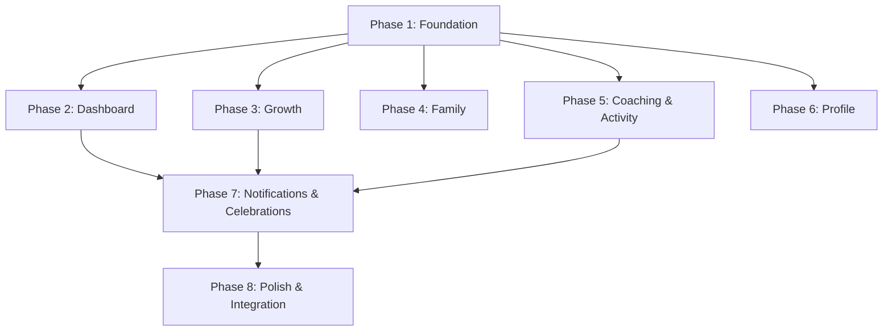

# Implementation Tasks: Father Workspace Frontend

## Definition of Done

Every task is considered complete when ALL of the following are satisfied:

1. **Code compiles** — `npm run build` passes without errors
2. **Types are correct** — no TypeScript errors (`tsc --noEmit` passes)
3. **Lint passes** — no ESLint errors on modified files
4. **Tests pass** — all existing and new tests green
5. **Requirement traceability** — the implementation satisfies all acceptance criteria listed in the task's requirement references
6. **Accessibility baseline** — interactive elements have appropriate ARIA labels; semantic HTML used
7. **No regressions** — existing functionality unchanged
8. **Self-review** — code reviewed by author before PR submission

For test tasks specifically:
- Tests cover happy path + at least one error/edge case
- Tests are deterministic (no flaky assertions)
- Tests use mock service layer (not real API calls)

---

## Recommended Pull Request Strategy

Implementation should be split into incremental, reviewable PRs. Each PR should be independently mergeable to `main` without breaking the application.

| PR | Contents | Prerequisite |
|----|----------|-------------|
| **PR 1** | Phase 1 tasks 1.1–1.7 (routing, layout, types, apiClient, services, query setup) | None |
| **PR 2** | Phase 1 tasks 1.8–1.13 (hooks, common components) | PR 1 merged |
| **PR 3** | Phase 2 (Dashboard home) | PR 2 merged |
| **PR 4** | Phase 3 (Growth: belt, achievements, streak) | PR 2 merged |
| **PR 5** | Phase 4 (Family: children, goals) | PR 2 merged |
| **PR 6** | Phase 5 (Coaching history + Activity logging) | PR 2 merged |
| **PR 7** | Phase 6 (Profile section) | PR 2 merged |
| **PR 8** | Phase 7 (Notifications + Celebrations) | PR 3, PR 4, PR 6 merged |
| **PR 9** | Phase 8 (Responsive, RTL, accessibility, analytics, e2e) | All prior PRs merged |

**Notes:**
- PRs 3–7 can be developed and reviewed in parallel after PR 2 merges
- Each PR should include its phase's test task
- PR descriptions should reference the task IDs and requirements covered
- Feature flags are not needed — workspace routes are behind auth guard

---

## Task Dependency Graph

## Tasks

- [ ] 1. Phase 1: Foundation — Routing, Layout, Services
  - [ ] 1.1 Create workspace route group `app/(workspace)/layout.tsx` with authentication guard that redirects unauthenticated users. Include shell layout with content area slot.
    - _Requirements: 1.1, 17.1_
  - [ ] 1.2 Create `src/components/layout/TabNavigation.tsx` — 5-tab navigation component (Home, Growth, Family, Coaching, Profile). Active tab highlighted via URL matching. Render as bottom tab bar (mobile implementation deferred to Phase 8).
    - _Requirements: 1.1_
  - [ ] 1.3 Create `src/components/layout/WhatsAppBridge.tsx` — persistent WhatsApp deep link component. Opens WhatsApp with Dad Coach number. Subtle styling, never competing with content.
    - _Requirements: 1.5_
  - [ ] 1.4 Create `src/types/` TypeScript type definitions: `workspace.ts`, `growth.ts`, `family.ts`, `coaching.ts`, `notifications.ts`, `common.ts`. Define all DTOs matching backend API contracts from WEB-SPEC-008.
    - _Requirements: All_
  - [ ] 1.5 Create `src/lib/api-client.ts` — central HTTP client wrapping fetch. Handles: base URL resolution (from `src/config/api.ts`), auth header injection, JSON serialization, HTTP error classification (network, 401, 404, 429, 5xx), typed `ApiError` throwing, request timeout. Also create `src/config/api.ts` with base URL and timeout constants.
    - _Requirements: All (infrastructure)_
  - [ ] 1.6 Create `src/services/` feature service modules: `workspace.ts`, `growth.ts`, `family.ts`, `coaching.ts`, `notifications.ts`. Each imports `apiClient` and exports typed fetch functions for its domain endpoints. No business logic — pure API call wrappers.
    - _Requirements: All_
  - [ ] 1.7 Set up data fetching infrastructure with caching (TanStack Query or equivalent). Create `src/lib/query-client.ts` with default config (stale times, retry behavior, error handling). Create `src/providers/QueryProvider.tsx`. Wire into workspace layout.
    - _Requirements: 1.2, 17.1_
  - [ ] 1.8 Create query hooks for dashboard and growth: `useWorkspaceSummary`, `useBeltProgression`, `useStreak`, `useAchievements`, `useCelebrations`. Each wraps the service layer with appropriate cache keys and stale times.
    - _Requirements: 1.1, 2.1, 3.1, 4.1, 16.1_
  - [ ] 1.9 Create query hooks for family, coaching, and profile: `useChildren`, `useChildDetail`, `useGoals`, `useGoalDetail`, `useConversations`, `useNotifications`, `useProfile`. Each wraps the service layer with appropriate cache keys and stale times.
    - _Requirements: 5.1, 6.1, 7.1, 8.1, 9.1, 12.1, 13.1_
  - [ ] 1.10 Create `src/components/common/SkeletonScreen.tsx` — reusable skeleton loading primitives (card skeleton, list skeleton, text skeleton). No spinners.
    - _Requirements: 17.1_
  - [ ] 1.11 Create `src/components/common/EmptyState.tsx` — reusable empty state component with illustration slot, message, and optional action button. Warm copy per Tone of Voice.
    - _Requirements: 17.7_
  - [ ] 1.12 Create `src/components/common/ErrorState.tsx` — reusable error display for network, server, and offline states. Includes retry button. Copy follows Tone of Voice.
    - _Requirements: 17.2, 17.3, 17.4_
  - [ ] 1.13 Create `src/components/common/ProgressBar.tsx` — reusable progress fill bar component. Fills only (never depletes). Supports percentage input. Accessible with aria-valuenow.
    - _Requirements: 2.4_

- [ ] 2. Phase 2: Dashboard Home (Screen D1)
  - [ ] 2.1 Create `app/(workspace)/dashboard/page.tsx` — Dashboard home page. Composes summary cards from workspace summary hook. Handles partial degradation (null sections rendered as placeholders via SkeletonScreen or neutral placeholder).
    - _Requirements: 1.1, 1.3_
  - [ ] 2.2 Create `src/components/dashboard/BeltSummaryCard.tsx` — compact belt display showing current belt name, score, and mini progress bar. Links to Growth tab.
    - _Requirements: 1.1, 2.1_
  - [ ] 2.3 Create `src/components/dashboard/StreakSummaryCard.tsx` — compact streak display showing current streak days. Never shows "at risk." Links to Growth/Streak.
    - _Requirements: 1.1, 4.1, 4.2_
  - [ ] 2.4 Create `src/components/dashboard/ActiveMissionCard.tsx` — displays current active mission (title, child, category) or null state if no mission. Read-only.
    - _Requirements: 1.1_
  - [ ] 2.5 Create `src/components/dashboard/EmptyDashboard.tsx` — first-visit empty state explaining: "Coaching happens on WhatsApp. This dashboard tracks your progress." Warm, inviting.
    - _Requirements: 1.4_
  - [ ] 2.6 Create `src/components/layout/NavigationBadge.tsx` — notification count badge component. Simple dot or count. Never red. Updates from workspace summary unread_notifications_count.
    - _Requirements: 12.3, 12.4_
  - [ ] 2.7 Write tests for Dashboard: renders all sections with complete data, handles partial degradation (null growth_score), renders empty state for new father, skeleton shows during load.
    - _Requirements: 1.1, 1.2, 1.3, 1.4_

- [ ] 3. Phase 3: Growth Section (Screens G1, G2, G3)
  - [ ] 3.1 Create `app/(workspace)/growth/page.tsx` — Growth Overview page displaying belt progression and score breakdown. Uses `useBeltProgression` and growth score hooks.
    - _Requirements: 2.1, 2.2_
  - [ ] 3.2 Create `src/components/belts/BeltProgressDisplay.tsx` — full belt view: current belt visual (SVG from `public/belts/`), score, next belt, points remaining, percentage progress bar. BLACK belt shows mastery state.
    - _Requirements: 2.1, 2.2, 2.3, 2.4_
  - [ ] 3.3 Create `src/components/belts/BeltBadge.tsx` — belt icon component. Loads SVG by belt name from `public/belts/belt-{name}.svg`. Fallback to text label if asset missing.
    - _Requirements: 2.2_
  - [ ] 3.4 Create `src/components/belts/ScoreBreakdown.tsx` — displays score by signal type (from growth score endpoint). Shows recent signals list.
    - _Requirements: 2.1_
  - [ ] 3.5 Create `app/(workspace)/growth/achievements/page.tsx` — Achievements page using `useAchievements` hook. Renders AchievementGallery component.
    - _Requirements: 3.1_
  - [ ] 3.6 Create `src/components/achievements/AchievementGallery.tsx` — renders all achievements grouped by category. Earned shows date. Unearned shown as available (not locked). Highlights "next achievable."
    - _Requirements: 3.1, 3.2, 3.3, 3.4, 3.5_
  - [ ] 3.7 Create `src/components/achievements/AchievementCard.tsx` — single achievement card with icon (from `public/achievements/`), name, description, earned status. Accessible labels for screen readers.
    - _Requirements: 3.2_
  - [ ] 3.8 Create `app/(workspace)/growth/streak/page.tsx` — Streak page using `useStreak` hook. Displays current, longest, milestones. Zero-streak shows encouraging message.
    - _Requirements: 4.1, 4.2, 4.3, 4.4_
  - [ ] 3.9 Write tests for Growth: belt renders correctly for all 8 levels, BLACK belt shows mastery, achievements grouped by category, unearned are not locked/greyed, streak zero shows encouraging message, no "at risk" language present anywhere.
    - _Requirements: 2.1–2.5, 3.1–3.5, 4.1–4.4_

- [ ] 4. Phase 4: Family Section (Screens F1, F2, F3, F4)
  - [ ] 4.1 Create `app/(workspace)/family/page.tsx` — Children Overview. Uses `useChildren` hook. Renders child cards with name, age, recent mission, goals count. Birthday indicator within 7 days. Empty state if no children.
    - _Requirements: 5.1, 5.2, 5.3, 5.4_
  - [ ] 4.2 Create `app/(workspace)/family/children/[childId]/page.tsx` — Child Detail page. Uses `useChildDetail` hook. Displays all child info read-only. Back navigation to family overview.
    - _Requirements: 6.1, 6.2, 6.3_
  - [ ] 4.3 Create `app/(workspace)/family/goals/page.tsx` — Goals Overview. Uses `useGoals` hook. Renders goal cards with progress bars. Supports filtering by status, category, child. Empty state explains goals come from WhatsApp.
    - _Requirements: 7.1, 7.2, 7.3, 7.4_
  - [ ] 4.4 Create `app/(workspace)/family/goals/[goalId]/page.tsx` — Goal Detail page. Uses `useGoalDetail` hook. Read-only mission list. Back navigation to goals overview.
    - _Requirements: 8.1, 8.2, 8.3_
  - [ ] 4.5 Write tests for Family: children render with dynamically computed ages, birthday indicator shows within 7 days, goals progress percentage displays correctly (capped at 100%), filtering works, empty states render with correct copy.
    - _Requirements: 5.1–5.5, 7.1–7.4_

- [ ] 5. Phase 5: Coaching & Activity Logging (Screens C1, C2, C3, C4)
  - [ ] 5.1 Create `app/(workspace)/coaching/page.tsx` — Coaching History list. Uses `useConversations` hook. Renders conversation cards (type, date, message count, summary, status). Empty state explains WhatsApp coaching.
    - _Requirements: 9.1, 9.2, 9.3, 9.5_
  - [ ] 5.2 Create `app/(workspace)/coaching/[conversationId]/page.tsx` — Conversation Detail. Summary view only (no full transcript, no system prompts). Back to list.
    - _Requirements: 9.4_
  - [ ] 5.3 Create `src/hooks/useLogActivity.ts` — mutation hook for both quality time and positive activity logging. Handles optimistic update (show confirmation immediately), cache invalidation (workspace-summary, growth-score, growth-streak), and error revert.
    - _Requirements: 10.3, 11.3_
  - [ ] 5.4 Create `app/(workspace)/coaching/log/page.tsx` — Activity Log page with type selector: "Log Quality Time" and "Log Positive Activity." Renders appropriate form based on selection.
    - _Requirements: 10.1, 11.1_
  - [ ] 5.5 Implement quality time form within log page: child selector (required, from father's children), duration input (15–480, optional), description (optional, max 200 chars), date picker (today default, not future, not >7 days past). Inline validation errors.
    - _Requirements: 10.1, 10.2, 10.5, 10.6_
  - [ ] 5.6 Implement positive activity form within log page: activity type selector (required: PRAISE, SHARED_ACTIVITY, TEACHING_MOMENT, QUALITY_CONVERSATION, OTHER), child (optional), description (optional, max 200 chars), date (same constraints). Inline validation.
    - _Requirements: 11.1, 11.2_
  - [ ] 5.7 Create activity confirmation view (inline or screen C4): points awarded, streak impact, encouraging message. "Done" returns to previous screen with updated data.
    - _Requirements: 10.3, 11.3_
  - [ ] 5.8 Handle rate limit (429) and duplicate detection errors in activity forms. Show friendly inline messages — never punitive copy. Rate limit: "You've reached today's limit." Duplicate: clear explanation of what was duplicated.
    - _Requirements: 10.4, 10.5, 11.4_
  - [ ] 5.9 Write tests for Activity Logging: successful submission shows confirmation with correct points (12 for quality time, 5 for positive activity), rate limit shows friendly message, duplicate quality time rejected clearly, validation errors appear inline, date constraints enforced (future rejected, >7 days rejected).
    - _Requirements: 10.1–10.7, 11.1–11.6_

- [ ] 6. Phase 6: Profile Section (Screens P1–P5)
  - [ ] 6.1 Create `app/(workspace)/profile/page.tsx` — Profile Overview. Uses `useProfile` hook. Read-only display: name, phone (masked), timezone, coaching style, preferred coaching time, language, coaching phase, days since activation.
    - _Requirements: 13.1_
  - [ ] 6.2 Create `app/(workspace)/profile/edit/page.tsx` — Edit Profile form (name, timezone, email). Save via Application API. Inline confirmation without page reload. Invalidates profile + summary cache on success.
    - _Requirements: 13.2, 13.3, 13.4_
  - [ ] 6.3 Create `app/(workspace)/profile/children/page.tsx` — Children Management list view. Displays all children with edit and archive action buttons. Shows "Add Child" button (disabled if at 8 children).
    - _Requirements: 14.1, 14.3_
  - [ ] 6.4 Implement add/edit child form within children management: name (required), birth date (required, 0–18 years past), gender, interests, challenges. Inline validation. Save invalidates children + summary cache.
    - _Requirements: 14.2, 14.5_
  - [ ] 6.5 Implement archive child flow: confirmation dialog required before archive. Non-reversible in UI. After archive, child removed from list immediately (optimistic).
    - _Requirements: 14.4_
  - [ ] 6.6 Create `app/(workspace)/profile/preferences/page.tsx` — Preferences editor: coaching style (4 options), preferred coaching time, notification frequency, quiet hours. Save via Application API with confirmation message.
    - _Requirements: 15.1, 15.2, 15.3_
  - [ ] 6.7 Create `app/(workspace)/profile/account/page.tsx` — Account page. For MVP: display account status only. Pause and delete are documented as future.
    - _Requirements: N/A (future placeholder)_
  - [ ] 6.8 Write tests for Profile: profile displays all fields with phone masked, edit saves and confirms, children list renders, add child form validates (birth date 0–18 years), max 8 enforced (button disabled), archive requires confirmation, preferences save with confirmation.
    - _Requirements: 13.1–13.4, 14.1–14.5, 15.1–15.3_

- [ ] 7. Phase 7: Notifications & Celebrations (Screens U1, U2)
  - [ ] 7.1 Create `app/(workspace)/notifications/page.tsx` — Notifications list with pagination. Uses `useNotifications` hook. Displays type, title, body, created_at, read status, priority. Mark-as-read individual buttons. "Mark All Read" bulk action. Empty state.
    - _Requirements: 12.1, 12.2, 12.5_
  - [ ] 7.2 Create `src/hooks/useMarkRead.ts` — mutation hook for mark-read (list of IDs) and mark-all-read. Optimistic update: badge count decrements immediately, notification list updates. Reverts on failure.
    - _Requirements: 12.2_
  - [ ] 7.3 Create `src/components/common/CelebrationModal.tsx` — celebration overlay component. Accepts a queue of celebration events. Displays one at a time: event type, title, encouragement message. Dismiss on click or swipe. Marks as displayed via API on dismiss. Dignified animation (subtle fade/scale, not confetti).
    - _Requirements: 16.1, 16.2, 16.3, 16.4, 16.5, 16.6, 16.7_
  - [ ] 7.4 Integrate celebration check into dashboard: on dashboard mount, fetch undisplayed celebrations via `useCelebrations` hook. If any exist, queue them in client state and render CelebrationModal before father interacts with dashboard content.
    - _Requirements: 16.1, 16.4_
  - [ ] 7.5 Write tests for Notifications: list renders with correct data, mark-read updates badge count, mark-all clears badge to zero, empty state renders. Celebrations: modal appears when undisplayed events exist, sequential display works, dismiss triggers mark-displayed API call, modal does not reappear after dismiss.
    - _Requirements: 12.1–12.5, 16.1–16.7_

- [ ] 8. Phase 8: Polish & Integration
  - [ ] 8.1 Implement responsive navigation: mobile bottom tab bar (< 768px), desktop persistent sidebar (> 1024px), tablet adaptive (768–1024px). Touch targets 44×44px minimum on mobile. WhatsApp bridge renders as FAB on mobile, sidebar link on desktop.
    - _Requirements: 1.1, 1.5_
  - [ ] 8.2 Implement RTL support: configure CSS logical properties throughout (margin-inline-start, padding-inline-end, etc.), set dir attribute from language preference, flip direction-dependent icons (arrows, progress). Test Hebrew layout.
    - _Requirements: N/A (accessibility requirement from WEB-SPEC-008)_
  - [ ] 8.3 Implement keyboard navigation and focus management: all interactive elements reachable via Tab, Enter/Space activates, Escape closes modals, focus trapped in celebration modal, focus restored on modal close, focus moves to content on tab navigation.
    - _Requirements: N/A (accessibility requirement from WEB-SPEC-008)_
  - [ ] 8.4 Add analytics event tracking: page views per tab, `activity_logged`, `celebration_viewed`, `celebration_dismissed`, `whatsapp_bridge_clicked`, `notification_opened`, `profile_updated`. Events fire via a thin analytics service abstraction.
    - _Requirements: N/A (analytics from WEB-SPEC-008)_
  - [ ] 8.5 End-to-end integration test: simulate Journey 2 (daily check-in — load dashboard, verify data renders), Journey 3 (log quality time — submit form, verify confirmation), Journey 4 (review growth — navigate to belt, achievements, streak). Verify cache invalidation after mutations.
    - _Requirements: 1.1, 2.1, 10.3_
